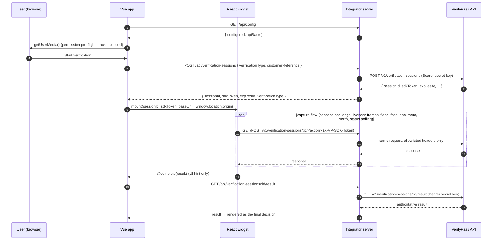

# VerifyPass Vue Sample: Implementation Guide

This document explains how `vue-sample/` is built and why. It is written for engineers who want to:

- run and extend the sample;
- reproduce the same integration in their own Vue 3 application; or
- review the security model before shipping.

For the five-minute quick start, see [../README.md](../README.md).

---

## Contents

1. [Purpose and constraints](#1-purpose-and-constraints)
2. [Architecture](#2-architecture)
3. [Directory layout](#3-directory-layout)
4. [How the SDK is obtained](#4-how-the-sdk-is-obtained)
5. [Embedding a React SDK in Vue](#5-embedding-a-react-sdk-in-vue)
6. [Host application flow (`App.vue`)](#6-host-application-flow-appvue)
7. [Server: session API](#7-server-session-api)
8. [Server: SDK relay](#8-server-sdk-relay)
9. [Production server](#9-production-server)
10. [Build configuration (Vite)](#10-build-configuration-vite)
11. [Configuration reference](#11-configuration-reference)
12. [Security model](#12-security-model)
13. [Running, building and verifying](#13-running-building-and-verifying)
14. [Troubleshooting](#14-troubleshooting)
15. [Adapting this to your own application](#15-adapting-this-to-your-own-application)
16. [Known limitations](#16-known-limitations)

---

## 1. Purpose and constraints

The sample demonstrates a **third-party integration**: a company that is *not* VerifyPass builds a Vue 3 web app and adds VerifyPass identity verification to it. The sample sticks to these constraints:

| Constraint | How it is met |
| --- | --- |
| Only use what an external customer could use | The SDK is downloaded from the public GitHub repository `ibonly/verifypass` at a pinned commit. Nothing is imported from sibling folders such as `../frontend/sdk`. |
| Vue host, React SDK | The only official web widget is `@verifypass/react`. It is mounted in a private React root owned by a Vue component. |
| Secret key never reaches the browser | Sessions are created and results are read by a small Node server that holds `VERIFYPASS_SECRET_KEY`. The browser receives only `{ sessionId, sdkToken }`. |
| Works without VerifyPass changing its CORS allowlist | The widget's API calls are sent to the app's own origin and relayed server-side. |
| Don't trust browser callbacks | The final decision shown to the user comes from a server-side result lookup, not from the widget's `onComplete` payload. |

The folder is self-contained. You can copy `vue-sample/` out of the monorepo and it still installs, builds and runs.

---

## 2. Architecture

### 2.1 Components

```text
┌──────────────────────────── Browser (one origin, e.g. http://localhost:5176) ───────────────────────────┐
│                                                                                                        │
│   Vue 3 app (src/App.vue)                                                                              │
│     ├─ src/lib/api.js ────────────────────────► /api/*      (session API on our server)               │
│     └─ <VerifyPassWidget> (Vue)                                                                        │
│          └─ React root ─ <VerifyPassProvider baseUrl=origin> ─ <VerificationWidget>                   │
│                            │                                                                           │
│                            ├─ camera (getUserMedia), ONNX face models (/models/*.onnx), ORT WASM       │
│                            └────────────────────────────► /v1/verification-sessions/:id/*  (relay)     │
└────────────────────────────────────────────────────────────────────────────────────────────────────────┘
                                   │                                    │
                                   ▼                                    ▼
┌──────────────────────────── Integrator server (Node) ───────────────────────────────────────────────────┐
│  server/verifypassApi.mjs  — /api/config, /api/verification-sessions, /api/…/result  (adds secret key)  │
│  server/sdkProxy.mjs       — /v1/verification-sessions/:id/<action>  (forwards sdkToken, NO secret)     │
│  Hosted by: Vite dev/preview middleware (vite.config.js) or server/index.mjs in production              │
└─────────────────────────────────────────────────────────────────────────────────────────────────────────┘
                                   │  HTTPS
                                   ▼
                         VerifyPass API (VERIFYPASS_API_BASE)
```

### 2.2 End-to-end sequence



### 2.3 Credentials

| Credential | Lives in | Sent by | Used for |
| --- | --- | --- | --- |
| `VERIFYPASS_SECRET_KEY` (`vp_sec_…`) | Server environment / `.env` | `verifypassApi.mjs` only | Creating sessions, reading results |
| `sdkToken` | Browser memory (Vue state) | The widget, as the `X-VP-SDK-Token` header or in the request body | Authorising capture calls for **one** session, for a short time |
| `VITE_VP_PUBLIC_KEY` (`vp_pub_…`, optional) | JS bundle | The widget, as `Authorization: Bearer` | Alternative embedded-SDK auth. It is checked against the tenant's domain allowlist. Unused by default. |

---

## 3. Directory layout

```text
vue-sample/
├── .env.example               # Template for server + public configuration
├── .gitignore                 # Ignores node_modules, dist, .env, vendor/, public/models/
├── .npmrc                     # install-links=true → file: deps are copied, not symlinked
├── README.md                  # Quick start
├── docs/
│   └── IMPLEMENTATION.md      # This document
├── index.html                 # Vite entry HTML (#app)
├── package.json               # Scripts + dependencies (SDK via file:vendor/…)
├── package-lock.json
├── scripts/
│   └── fetch-sdk.mjs          # Downloads the SDK + models from GitHub (pinned commit)
├── server/
│   ├── index.mjs              # Production HTTP server (static dist/ + API + relay)
│   ├── sdkProxy.mjs           # Narrow same-origin relay for the widget's /v1 calls
│   └── verifypassApi.mjs      # Session API (holds the secret key)
├── src/
│   ├── App.vue                # Host page: start session, embed widget, show verified result
│   ├── components/
│   │   └── VerifyPassWidget.vue  # Vue ⇄ React bridge for @verifypass/react
│   ├── lib/
│   │   └── api.js             # Browser client for /api/*
│   ├── main.js                # createApp(App).mount("#app")
│   └── style.css              # Plain CSS, no framework
├── vite.config.js             # Vue plugin, JSX/React pre-bundling, server middleware
│
│   (generated, git-ignored)
├── vendor/verifypass/{core,react,SOURCE.json}   # by `npm run sdk:fetch`
├── public/models/{fr_detect,fr_landmark}.onnx   # by `npm run sdk:fetch`
├── node_modules/
└── dist/                                        # by `npm run build`
```

---

## 4. How the SDK is obtained

### 4.1 Why not `npm install @verifypass/react`?

- `@verifypass/react` and `@verifypass/sdk-core` are **not published** to the npm registry.
- npm can install a git repository, but **not a sub-folder** of one. The SDK lives in `frontend/sdk/react` and `frontend/sdk/core`.
- `@verifypass/react` declares `"@verifypass/sdk-core": "file:../core"`, so the two packages must sit next to each other on disk.

### 4.2 `scripts/fetch-sdk.mjs`

`npm run sdk:fetch` (also run by `npm run setup`) does the following:

1. **Validates inputs.** `VERIFYPASS_SDK_REPO` must match `owner/name`, and `VERIFYPASS_SDK_REF` must match `[\w./-]+`. This stops anything odd from reaching URLs or `tar`.
2. **Resolves the ref to a commit SHA** using `GET https://api.github.com/repos/{repo}/commits/{ref}` with `Accept: application/vnd.github.sha`. A 40-character SHA is used as-is. The download is always tied to an exact commit, even when the ref is a moving branch.
3. **Downloads** `https://codeload.github.com/{repo}/tar.gz/{sha}` into a temporary directory.
4. **Extracts only the needed members** with `tar -xzf … <members>`:
   - `frontend/sdk/core/{package.json,src}`
   - `frontend/sdk/react/{package.json,src}`
   - `sample-app/public/models/fr_detect.onnx` and `fr_landmark.onnx`
5. **Writes** the packages to `vendor/verifypass/core` and `vendor/verifypass/react`, and the models to `public/models/`.
6. **Records provenance** in `vendor/verifypass/SOURCE.json`:

   ```json
   {
     "repository": "https://github.com/ibonly/verifypass",
     "ref": "main",
     "commit": "d9d2ee99b5d483b7fd7c349bc36e8146cb0a46ac",
     "packages": { "@verifypass/react": "0.1.0" },
     "fetchedAt": "2026-10-05T03:08:12.296Z"
   }
   ```

7. Removes the temporary directory, whether the run succeeded or failed.

Tests, the dashboard and other SDKs are never downloaded.

### 4.3 Installing the vendored packages

`package.json`:

```json
"@verifypass/react": "file:vendor/verifypass/react",
"@verifypass/sdk-core": "file:vendor/verifypass/core"
```

`.npmrc`:

```ini
install-links=true
```

With `install-links=true`, npm **copies** `file:` packages into `node_modules` instead of symlinking them. This matters because:

- Vite then treats the SDK as an ordinary dependency, so pre-bundling, dedupe and caching behave as they would for a registry package.
- There is no symlink into `vendor/`, so editing or deleting `vendor/` can't silently change a running build.
- `npm ls` shows a normal, deduplicated tree:

  ```text
  ├─┬ @verifypass/react@0.1.0
  │ ├── @verifypass/sdk-core@0.1.0 deduped
  │ ├── onnxruntime-web@1.30.0 deduped
  │ └── react@18.3.1 deduped
  ├── @verifypass/sdk-core@0.1.0
  ├── onnxruntime-web@1.30.0
  ├─┬ react-dom@18.3.1
  └── react@18.3.1
  ```

`@verifypass/sdk-core` is also listed directly, so the `file:../core` reference inside the React package resolves to the same copy.

### 4.4 Pinning and upgrading

```bash
VERIFYPASS_SDK_REF=<tag-or-40-char-sha> npm run sdk:fetch
npm install          # refresh node_modules copies
```

For reproducible CI builds, always pin a SHA. Commit or archive `SOURCE.json` alongside your release record so you can tell which SDK build shipped.

### 4.5 Peer and runtime dependencies

The integrator app supplies these, because the SDK does not bundle them:

| Package | Why |
| --- | --- |
| `react`, `react-dom` (^18.3) | Peer dependency of `@verifypass/react`. `react-dom/client` provides `createRoot`. |
| `onnxruntime-web` (^1.29) | In-browser face detection and landmark models that guide capture. |
| `vue` (^3.5) | Host framework. |

---

## 5. Embedding a React SDK in Vue

File: [`src/components/VerifyPassWidget.vue`](../src/components/VerifyPassWidget.vue)

### 5.1 Approach

React is treated as an implementation detail of a single Vue component. The component:

1. renders an empty `<div ref="container">`;
2. on `onMounted`, calls `createRoot(container)` from `react-dom/client`;
3. renders `createElement(VerifyPassProvider, providerProps, createElement(VerificationWidget, widgetProps))`, with no JSX in the Vue codebase;
4. re-renders the same root whenever any prop changes (`watch(() => ({ ...props }), render, { deep: true })`);
5. on `onBeforeUnmount`, calls `root.unmount()`. The SDK's own React cleanup then stops the camera, aborts in-flight requests and disposes the models.

Only one React root exists per widget instance. Vue owns the outer DOM and React owns everything inside the container.

### 5.2 Props

| Vue prop | Type | Passed to | Notes |
| --- | --- | --- | --- |
| `session-id` | `String` (required) | `VerificationWidget.sessionId` | From `POST /api/verification-sessions` |
| `sdk-token` | `String` (required) | `VerificationWidget.sdkToken` | Short-lived, session-scoped |
| `public-key` | `String \| null` | `VerifyPassProvider.publicKey` | `null` means token-only auth. `undefined` means the SDK default. |
| `base-url` | `String \| null` | `VerifyPassProvider.baseUrl` | Sample sets this to `window.location.origin` so calls go through the relay |
| `face-model-url` | `String \| null` | `VerifyPassProvider.faceModelUrl` | Default `/models/fr_detect.onnx` |
| `landmark-model-url` | `String \| null` | `VerifyPassProvider.landmarkModelUrl` | `undefined` means derived from the face model URL. `null` turns off landmarks. |
| `theme` | `Object` | `VerificationWidget.theme` | Supported keys: `primaryColor`, `logoUrl` |
| `consent-copy` | `String` | `VerificationWidget.consentCopy` | Overrides the SDK's default consent text |
| `screen-flash` | `Boolean` (default `true`) | `VerificationWidget.screenFlash` | Screen-flash liveness after the selfie |

**`undefined` vs `null`:** the SDK uses `undefined` to mean "use the configured default", and `null` to mean "explicitly disabled". `withoutUndefined()` drops `undefined` props before they reach React, so the SDK's own defaulting rules apply unchanged.

`VerifyPassProvider` also receives `env: import.meta.env`. This lets the SDK's `readPublicConfig()` see the app's `VITE_VP_*` values, which are validated by the SDK (HTTPS-only URLs, public keys only).

### 5.3 Events

| Vue event | React callback | Payload |
| --- | --- | --- |
| `complete` | `onComplete(result)` | Final session status object from the SDK's status polling. `result.status` is one of `approved`, `rejected`, `manual_review`, `expired`, `failed`, `abandoned`. |
| `error` | `onError(err)` | `Error`, often a `VerifyPassApiError` with `code`, `http` and `message` |
| `step-change` | `onStepChange(step)` | Step names depend on `verificationType` (see below) |

Step sequences come from `@verifypass/sdk-core`'s `STEP_SEQUENCES`:

| Verification type | Steps |
| --- | --- |
| `ID_AND_FACE` | `document` → (`document_back` for two-sided IDs) → `liveness` → `face` → `processing` → `complete` |
| `FACE_ONLY` | `liveness` → `face` → `processing` → `complete` |
| `ID_ONLY` | `document` → (`document_back`) → `processing` → `complete` |

The three handler functions are created **once** per component instance. React therefore sees the same callback identities on every re-render, and Vue's `emit` always targets the current listeners.

### 5.4 Remount semantics

The SDK keys its internal session component on `[sessionId, sdkToken, baseUrl, publicKey]`. Changing any of these props through Vue starts a fresh widget session with new camera, client and models. Changing `theme` or `consentCopy` only re-renders.

### 5.5 Why no `<StrictMode>`

React StrictMode mounts, unmounts and remounts effects in development. The SDK's camera, model loading and session effects are tested without StrictMode, and the monorepo's own React sample doesn't use it either. Wrapping the widget in StrictMode would double-start the camera and send duplicate session calls in dev.

---

## 6. Host application flow (`App.vue`)

File: [`src/App.vue`](../src/App.vue)

### 6.1 State

| Ref | Meaning |
| --- | --- |
| `serverConfig` | `{ configured, apiBase }` from `GET /api/config`. Used to warn when the secret key is missing and disable the start button. |
| `cameraState` | `pending` \| `granted` \| `denied` \| `unsupported` |
| `customerReference`, `verificationType` | Form inputs. `verificationType` defaults to `FACE_ONLY`. |
| `session` | `{ sessionId, sdkToken, expiresAt, verificationType }` or `null` |
| `widgetResult` | Last `@complete` payload (UI hint) |
| `verifiedResult` | Server-verified result from `/api/…/result` (authoritative) |
| `lastStep` | Last `@step-change` value, shown above the widget |
| `error`, `busy` | Inline error message and pending-request flag |

### 6.2 Lifecycle

1. **Mount:**
   - fetch `/api/config`;
   - call `getUserMedia({ video: { facingMode: "user" } })`, stopping the tracks right away. This only triggers the permission prompt early, so the widget can start the camera later without prompting mid-flow.
   - A `cancelled` flag stops state updates after unmount.
2. **Start:** `createVerificationSession()` is called, and the returned session mounts `<VerifyPassWidget>`.
3. **During capture:** `@step-change` updates `lastStep`. Any step other than `processing` or `complete` clears a stale result, because the widget's own **Try again** button restarts the flow inside the same mount.
4. **Complete:** `@complete` sets `widgetResult`. A `watch` then calls `getVerificationResult(sessionId)`. The response is ignored if the user has since started a different session, which prevents race conditions.
5. **Reset:** **Cancel** or **Run another** clears all session state. This unmounts the widget, which releases the camera.

### 6.3 Which view is shown

```text
session == null                                     → Start form
session && (no result || status is retryable)       → Widget card
result with a non-retryable status                  → Final result card
```

`RETRYABLE_STATUSES = ["rejected", "manual_review", "failed"]`. For these outcomes the widget's result screen offers **Try again**, and manual ID upload after repeated failures, so the widget must stay mounted. Unmounting it would hide that UI.

The final card's title uses `verifiedResult.status` when available, and falls back to the widget payload while the server lookup is in flight. It shows `status`, `riskLevel`, liveness status and score, face-match status and similarity, and decision reason codes. The full server JSON and the raw widget payload are available in collapsible `<details>` blocks.

### 6.4 Browser API client (`src/lib/api.js`)

| Function | Request | Returns |
| --- | --- | --- |
| `getServerConfig()` | `GET /api/config` | `{ configured: boolean, apiBase: string }` |
| `createVerificationSession({ customerReference, verificationType })` | `POST /api/verification-sessions` | `{ sessionId, sdkToken, expiresAt, verificationType }` |
| `getVerificationResult(sessionId)` | `GET /api/verification-sessions/:id/result` | VerifyPass result object |

Non-2xx responses throw `Error(body.error.message)`.

---

## 7. Server: session API

File: [`server/verifypassApi.mjs`](../server/verifypassApi.mjs)

`createVerifyPassApi(env)` returns a single Node `(req, res, next)` handler. This one handler is mounted by Vite in dev and preview, and by `server/index.mjs` in production, so the routes behave identically in every mode.

### 7.1 Routing

```text
/v1/*   → sdkProxy (section 8)
/api/*  → session API (below)
other   → next()  (Vite / static file serving)
```

### 7.2 Endpoints

#### `GET /api/config`

Always available, even without a secret key.

```json
{ "configured": true, "apiBase": "https://…lambda-url.us-east-2.on.aws" }
```

`configured` says whether `VERIFYPASS_SECRET_KEY` is set. The key itself is never returned.

#### `POST /api/verification-sessions`

Request body (JSON, at most 4 KiB):

```json
{ "verificationType": "FACE_ONLY", "customerReference": "user-123" }
```

| Field | Rule |
| --- | --- |
| `verificationType` | Must be `ID_AND_FACE`, `FACE_ONLY` or `ID_ONLY`. Anything else falls back to `ID_AND_FACE`. |
| `customerReference` | Trimmed and truncated to 128 characters. If empty, `VUE-SAMPLE-<timestamp>` is used. |

Upstream call: `POST {VERIFYPASS_API_BASE}/v1/verification-sessions` with `Authorization: Bearer <secret>`.

Response `201`. Only the fields the browser needs are returned; everything else from the upstream response (such as challenge details) is dropped:

```json
{ "sessionId": "vps_…", "sdkToken": "…", "expiresAt": "…", "verificationType": "FACE_ONLY" }
```

#### `GET /api/verification-sessions/:sessionId/result`

- `sessionId` must match `^[A-Za-z0-9_-]{1,128}$`. Otherwise the response is `400 Invalid session id`.
- Upstream call: `GET /v1/verification-sessions/:id/result` with the secret key.
- The upstream body is returned as-is. It includes `status`, `riskLevel`, `liveness`, `faceMatch`, `decision.reasonCodes`, `livenessChallenge` and more.

### 7.3 Errors

All error bodies have the shape `{ "error": { "message": "…" } }`, and every response sets `Cache-Control: no-store`.

| Situation | Status |
| --- | --- |
| Secret key not configured (any route except `/api/config`) | `503` |
| Invalid JSON body | `400` |
| Body over 4 KiB | `413` |
| Unknown `/api/*` route or method | `404` |
| Upstream 4xx | Same status, upstream `error.message` |
| Upstream 5xx | `502`, upstream message |
| Network or other failure reaching VerifyPass | `502 VerifyPass API request failed` |

---

## 8. Server: SDK relay

File: [`server/sdkProxy.mjs`](../server/sdkProxy.mjs)

### 8.1 Why it exists

The VerifyPass API answers CORS preflight requests only for origins on its `CORS_ORIGINS` allowlist. An integrator's origin, and especially a localhost dev port, is usually not on that list. If the widget calls the API directly from the browser, it fails with:

```text
Access to fetch at 'https://…/v1/verification-sessions/…' from origin 'http://localhost:5176'
has been blocked by CORS policy: Response to preflight request doesn't pass access control check
```

Session creation still works, because it is a server-to-server call and CORS doesn't apply. So the symptom is that the widget mounts, then shows **"Failed to fetch"**.

The sample sets the widget's `baseUrl` to `window.location.origin`. Every SDK call becomes a same-origin request to `/v1/…`, which the integrator server forwards.

### 8.2 What is forwarded

| Aspect | Rule |
| --- | --- |
| Paths | Only `^/v1/verification-sessions/<id>/<action>$`, where `<id>` is `[A-Za-z0-9_-]{1,128}` and `<action>` is `[a-z][a-z/-]{0,63}`. This covers `consent`, `challenge`, `challenge/begin`, `challenge/reissue`, `liveness-frame`, `flash`, `face`, `document`, `retry`, `verify` and `status`. |
| Methods | `GET` and `POST` only |
| Query strings | Rejected. The SDK sends the token in a header, and a token in a query string would end up in logs. |
| Request headers | Allowlist only: `accept`, `content-type`, `content-length`, `x-vp-sdk-token`, `x-correlation-id`, `user-agent`. `X-Forwarded-For` is set to the client socket address. Cookies, `Authorization` and anything else are dropped. |
| Response headers | Allowlist only: `content-type`, `content-length`, `cache-control`, `deprecation`, `x-vp-deprecated`, `x-correlation-id`. `Cache-Control: no-store` is always set. |
| Body size | 25 MiB cap. Larger requests are rejected up front using `Content-Length`, and a stream that grows past the cap mid-upload is cut off. Both return `413`. |
| Timeout | 60 s upstream socket timeout, then `502 UPSTREAM_UNAVAILABLE` |
| Streaming | Request and response bodies are piped, never buffered in full |
| Credentials | **The secret key is never added.** The browser's `X-VP-SDK-Token` (or `sdkToken` in the JSON body) remains the only credential, exactly as for a direct call. |

Requests that don't match return a JSON 404 in the SDK's error format: `{ "success": false, "error": { "code": "NOT_FOUND", … } }`. Notably, `POST /v1/verification-sessions` (session creation) and every non-session endpoint are **not** reachable through the relay.

### 8.3 Verified behaviour

The relay was exercised against the live test API:

```text
POST /api/verification-sessions                        → 201 { sessionId, sdkToken }
GET  /v1/verification-sessions/:id/status   (+token)   → 200 { success: true, status: "created", … }
GET  /v1/verification-sessions/:id/challenge (+token)  → 200 { livenessActions: [...] , … }
GET  /v1/verification-sessions/:id/status   (no token) → 401 INVALID_API_KEY        (upstream enforces)
GET  /v1/verification-sessions/:id/status?sdkToken=x   → 404                         (query rejected)
GET  /v1/tenants                                       → 404                         (not relayed)
POST /v1/verification-sessions                         → 404                         (not relayed)
```

### 8.4 Trade-off: client IP

Through the relay, VerifyPass sees the integrator server as the TCP peer. The proxy sets `X-Forwarded-For` to the browser's address, but whether VerifyPass uses it depends on its proxy-trust configuration (`TRUST_PROXY_HOPS`). Expect these effects:

- per-IP rate limits may count all users together, as the integrator server;
- client IPs recorded with consent and verification may be the server's.

If either matters, ask VerifyPass to add your production origin to `CORS_ORIGINS`, then set `VITE_VP_API_BASE`. The widget will call the API directly and the relay goes unused.

---

## 9. Production server

File: [`server/index.mjs`](../server/index.mjs)

A dependency-free `node:http` server for `npm start`:

- Loads `.env` with `process.loadEnvFile()` (Node ≥ 20.12) if the file exists. Variables already set in the environment take precedence.
- Routes every request through `createVerifyPassApi()` first, which covers `/api/*` and `/v1/*`.
- Serves `dist/` for other `GET`/`HEAD` requests. Other methods get `405`.
  - **Path traversal guard:** the resolved path must stay inside `dist/`.
  - **SPA fallback** to `index.html`, but **only for extension-less paths**. A missing `/models/x.onnx` or `.wasm` returns `404`, never HTML. Otherwise ONNX Runtime would try to compile HTML as WASM.
  - **Caching:** `dist/assets/*` (hashed filenames) gets `public, max-age=31536000, immutable`; everything else gets `no-cache`.
  - **MIME types**, including `application/wasm` for the ONNX Runtime binary, which browsers require for streaming compilation.
- Security headers on static responses: `X-Content-Type-Options: nosniff`, `Referrer-Policy: no-referrer`, `Permissions-Policy: camera=(self)`.
- `PORT` defaults to `8080`. It warns at startup if `VERIFYPASS_SECRET_KEY` is missing.

Terminate TLS in front of it (load balancer, reverse proxy or platform router). Browsers only allow camera access in a secure context: HTTPS, or `localhost` during development.

---

## 10. Build configuration (Vite)

File: [`vite.config.js`](../vite.config.js)

The SDK is published as **source**: untranspiled `.jsx` files and a **CommonJS** core (`require`/`exports`). Each setting below fixes a specific failure.

| Setting | Why it is needed | Symptom without it |
| --- | --- | --- |
| `plugins: [vue(), verifyPassServerApi(env)]` | Compiles `.vue` files, and mounts the session API and relay on `configureServer` and `configurePreviewServer` | `/api/*` and `/v1/*` 404 in dev and preview |
| `esbuild.jsx: "automatic"` | Transforms the SDK's `.jsx` with the React 17+ automatic runtime | `React is not defined` |
| `optimizeDeps.include: ["@verifypass/react", …]` + `esbuildOptions.jsx: "automatic"` | Pre-bundles the SDK into **one** module graph, so `VerifyPassProvider` and `VerificationWidget` share a single React context. It also converts the CommonJS core to ESM. | Dev only: `useVerifyPass must be used inside <VerifyPassProvider>`, because Vite served `VerifyPassProvider.jsx` under two URLs (with and without `?v=hash`) and so created two contexts |
| `optimizeDeps.include: ["react", "react/jsx-runtime", "react/jsx-dev-runtime", "react-dom/client"]` | These are CommonJS; pre-bundling exposes ESM named exports | `does not provide an export named 'jsxDEV'` |
| `resolve.dedupe: ["react", "react-dom"]` | Guarantees a single React copy | "Invalid hook call" errors |
| `server.port: 5176, strictPort: true` | Fixed dev port, so it doesn't clash with the monorepo's sample on 5175 | — |
| Server env loading | `loadEnv(mode, cwd, "VERIFYPASS_")` merged with `VERIFYPASS_*` from `process.env`; process env wins | — |

The SDK's `faceDetector.js` imports `onnxruntime-web/ort-wasm-simd-threaded.wasm?url`. Vite resolves this to a hashed asset URL in both dev and build, and hands it to ONNX Runtime as `wasmPaths`. As a result the runtime is served from your origin, never a CDN.

Only `VITE_*` variables are exposed to browser code. `VERIFYPASS_*` values are read in the Node process that runs `vite.config.js`, and never reach the bundle. A grep of the production bundle for `vp_sec_` finds nothing.

### Build output (approximate)

```text
dist/index.html                                   0.5 kB
dist/assets/index-*.css                           1.6 kB
dist/assets/index-*.js                          298   kB  (105 kB gzip) — Vue + React + SDK
dist/assets/ort.wasm.bundle.min-*.js             74   kB  (lazy-loaded)
dist/assets/ort-wasm-simd-threaded-*.wasm    14,240   kB  (3.7 MB gzip, lazy-loaded)
dist/models/fr_detect.onnx                     1.2 MB
dist/models/fr_landmark.onnx                   1.1 MB
```

ONNX Runtime and the models are fetched only when the widget mounts, not on first page load.

---

## 11. Configuration reference

Copy `.env.example` to `.env`. `.env` is git-ignored.

### Server only (never prefixed with `VITE_`)

| Variable | Default | Description |
| --- | --- | --- |
| `VERIFYPASS_SECRET_KEY` | — (required) | `vp_sec_test_…` or `vp_sec_live_…`. Creates sessions and reads results. |
| `VERIFYPASS_API_BASE` | Live test API URL | VerifyPass API origin, used by the session API and the relay |
| `PORT` | `8080` | `npm start` only |

### Public (embedded in the JS bundle, so never put secrets here)

| Variable | Default | Description |
| --- | --- | --- |
| `VITE_VP_PUBLIC_KEY` | unset (token-only auth) | Optional `vp_pub_…` key. If set, your origin must be in the tenant's allowed domains. |
| `VITE_VP_API_BASE` | unset (use relay) | If set, the widget calls this origin directly instead of the same-origin relay. That origin must allowlist yours for CORS. |
| `VITE_VP_FACE_MODEL_URL` | `/models/fr_detect.onnx` | Face detector model |
| `VITE_VP_LANDMARK_MODEL_URL` | sibling of the face model | Landmark model used for head-pose (active liveness) |

### SDK fetch

| Variable | Default | Description |
| --- | --- | --- |
| `VERIFYPASS_SDK_REPO` | `ibonly/verifypass` | GitHub `owner/repo` |
| `VERIFYPASS_SDK_REF` | `main` | Branch, tag or full commit SHA |

Changes to `VITE_*` need a dev-server restart or a rebuild. Changes to `VERIFYPASS_*` need a server restart.

---

## 12. Security model

| Threat | Mitigation |
| --- | --- |
| Secret key leaked to the browser | Read only by Node code. Never prefixed with `VITE_`. `/api/config` returns a boolean, not the key. The session response is stripped down to four fields. Production bundle verified clean. |
| Relay used as an open proxy | Fixed upstream host. Strict path regex. Only `GET`/`POST`. No query strings. Header allowlists in both directions. 25 MiB cap. 60 s timeout. |
| Relay used to escalate privileges | Secret key never attached to relayed requests. Upstream still checks each `sdkToken` against its session (a missing token returns `401`). Session creation and tenant endpoints are not relayed. |
| `sdkToken` exposed in logs | Query strings are rejected by the relay. The SDK sends the token in the `X-VP-SDK-Token` header. |
| Trusting a forged client result | The final decision comes from a server-side `GET …/result` using the secret key, not from `@complete`. |
| Oversized or malformed JSON to `/api` | 4 KiB body cap, JSON parse errors return `400`, inputs normalised (`verificationType` allowlist, `customerReference` length cap) |
| Static file traversal | Resolved path must stay under `dist/`. Missing assets with extensions return `404`. |
| Untrusted SDK source | SDK pinned to a commit SHA, with provenance recorded in `SOURCE.json`. Download inputs validated. Only specific archive members extracted. |
| Camera abuse | `Permissions-Policy: camera=(self)`. Camera released when the widget unmounts. |

**What the sample deliberately does not do.** A real integration must add these:

1. **User authentication on `/api/*`.** Anyone who can reach the sample server can create sessions billed to your tenant.
2. **Deriving `customerReference` from the authenticated user** rather than from request input.
3. **Ownership checks**: only return `/result` for sessions created for the current user. Store the `sessionId` ↔ user mapping when the session is created.
4. **Rate limiting** on session creation and on the relay.
5. **Webhooks** (verified signatures) as the primary signal for granting access, with `/result` as a fallback.
6. **A Content Security Policy** that allows `wasm-unsafe-eval` for ONNX Runtime, `self` for models and API calls, and nothing else.

---

## 13. Running, building and verifying

### 13.1 Requirements

- Node.js ≥ 20.12 (for `process.loadEnvFile` and the global `fetch`)
- `tar` (bundled with macOS, Linux and Windows 10+)
- Outbound HTTPS to `api.github.com`, `codeload.github.com` and the VerifyPass API

### 13.2 Commands

| Command | What it does |
| --- | --- |
| `npm run setup` | `sdk:fetch`, then `npm install` |
| `npm run sdk:fetch` | Re-downloads the SDK and models (honours `VERIFYPASS_SDK_REF`) |
| `npm run dev` | Vite dev server on `http://localhost:5176`, with the session API and relay |
| `npm run build` | Production bundle in `dist/` |
| `npm run preview` | Serves `dist/` on `http://localhost:4176`, with the session API and relay |
| `npm start` | Production Node server on `PORT` (default 8080) |

### 13.3 Manual verification checklist

1. `curl localhost:5176/api/config` returns `{"configured":true,…}`.
2. Open the app. The camera banner turns green after you allow access.
3. Choose **Face only** and select **Start verification**. The widget shows the consent screen.
4. In DevTools → Network, every widget request goes to `localhost:5176/v1/…`. There are no CORS errors and no requests to the VerifyPass origin.
5. Complete the flow. The final card shows the **server-verified** status, risk and reason codes.
6. **Cancel** mid-flow. The camera indicator turns off.
7. `npm run build && grep -l vp_sec_ dist/assets/*.js` prints nothing.

---

## 14. Troubleshooting

| Symptom | Cause | Fix |
| --- | --- | --- |
| Widget shows **"Failed to fetch"**, and the console shows a CORS error for the VerifyPass origin | The widget is calling the API directly from a non-allowlisted origin | Leave `VITE_VP_API_BASE` unset so the relay is used, or get your origin added to `CORS_ORIGINS` |
| Yellow banner: **Server is missing VERIFYPASS_SECRET_KEY** | `.env` is missing, or the variable is unset or empty | Set it in `vue-sample/.env` and restart the server |
| `API key invalid or revoked` when starting a session | Wrong, revoked, or test/live-mismatched secret key | Generate a new key in the VerifyPass dashboard |
| `API key invalid or revoked` inside the widget | `sdkToken` expired, or belongs to a different session | Start a new session |
| `token does not embed an API origin — pass baseUrl explicitly` | A legacy token without an embedded API origin, and no `baseUrl` given | The sample always passes `baseUrl`. Keep `base-url` bound when reusing the component. |
| `useVerifyPass must be used inside <VerifyPassProvider>` (dev) | The SDK isn't pre-bundled, so two copies of the context module exist | Keep `@verifypass/react` in `optimizeDeps.include`. Restart with `npx vite --force`. |
| `does not provide an export named 'jsxDEV'` | `react/jsx-dev-runtime` not pre-bundled | Keep it in `optimizeDeps.include` |
| Stuck on **Loading face model…** | `public/models/*.onnx` missing, or an HTML fallback was served instead of the model | Run `npm run sdk:fetch`. Make sure your host returns 404 (not `index.html`) for missing files. |
| Camera banner red: **Camera blocked** | Permission denied, or the page isn't a secure context | Allow the camera in site settings. Use HTTPS or `localhost`. |
| `npm install` fails with `EACCES … ~/.npm/_cacache` | The local npm cache contains root-owned files | `sudo chown -R $(id -u):$(id -g) ~/.npm`, or use `npm install --cache /tmp/npm-cache` |
| `Port 5176 is already in use` | Another dev server is running | Stop it, or run `npx vite --port <other>` |
| `fetch-sdk: Could not resolve … HTTP 403` | GitHub API rate limit for unauthenticated requests | Wait, or pass a full commit SHA in `VERIFYPASS_SDK_REF`, which skips the API call |

---

## 15. Adapting this to your own application

**Copy these files:**

- `src/components/VerifyPassWidget.vue`: unchanged.
- `server/sdkProxy.mjs`: if your origin isn't on VerifyPass's CORS allowlist. Port it to your framework (Express, Fastify, Nuxt server routes, …) and keep the same allowlists.
- The **logic** of `server/verifypassApi.mjs`, moved into your authenticated backend.
- The `optimizeDeps`, `esbuild.jsx` and `resolve.dedupe` settings from `vite.config.js`.

**Using it in a component:**

```vue
<script setup>
import VerifyPassWidget from "@/components/VerifyPassWidget.vue";

const props = defineProps({ session: Object }); // { sessionId, sdkToken } from YOUR backend
const emit = defineEmits(["done"]);
const apiOrigin = window.location.origin; // same-origin relay; templates can't access `window`
</script>

<template>
  <VerifyPassWidget
    :session-id="session.sessionId"
    :sdk-token="session.sdkToken"
    :public-key="null"
    :base-url="apiOrigin"
    :theme="{ primaryColor: '#0F766E', logoUrl: '/logo.svg' }"
    @complete="() => emit('done', session.sessionId)"
    @error="(e) => console.error(e)"
  />
</template>
```

Then confirm the outcome on your backend (webhook or `/result`) before granting access.

**Nuxt / SSR:** the widget uses `window`, `navigator.mediaDevices` and `react-dom/client`. Render it client-only, for example `<ClientOnly><VerifyPassWidget … /></ClientOnly>`, or import the component dynamically on the client.

**Vue Router:** unmounting a route unmounts the widget, which releases the camera. Avoid wrapping the widget route in `<KeepAlive>`, because that would keep the camera session alive in the background.

**Other bundlers:** the requirements are the same. Transpile `.jsx` with the automatic runtime, convert the CommonJS core to ESM, keep a single React instance, and emit `ort-wasm-simd-threaded.wasm` as an asset whose URL the `?url` import resolves to.

---

## 16. Known limitations

- **No authentication or ownership checks** on `/api/*` (see section 12). This sample is not production-ready as-is.
- **Client IP seen by VerifyPass** is the integrator server's when the relay is used (section 8.4).
- **Two UI frameworks in one bundle.** React and react-dom add about 130 kB (about 45 kB gzip) on top of Vue. A framework-free alternative is the hosted/iframe SDK (`frontend/sdk/js`), which trades in-page styling control for no React dependency.
- **The SDK is vendored, not versioned on a registry.** Upgrades are a manual `sdk:fetch` and `npm install`. Pin SHAs in CI.
- **Browser coverage** has been checked in desktop Chromium only. Validate on physical iOS and Android devices before release, especially camera permissions and WASM memory limits.
